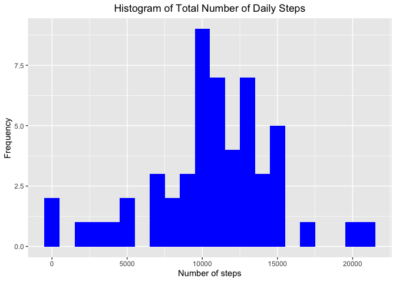
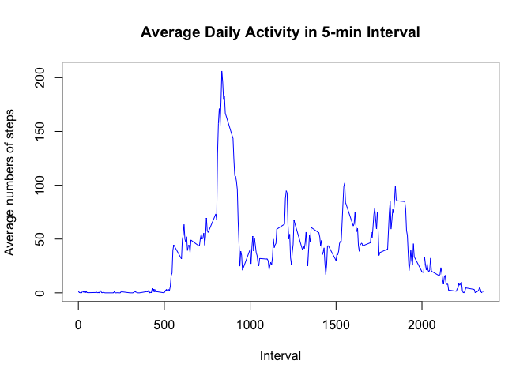
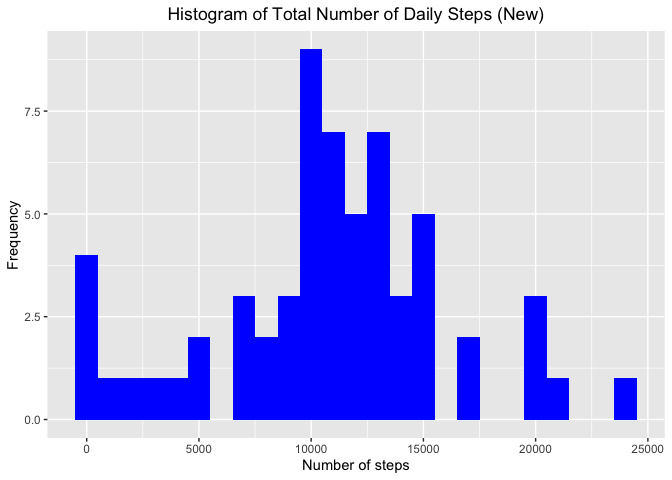
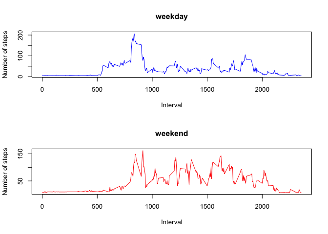

## Introduction

It is now possible to collect a large amount of data about personal movement using activity monitoring devices such as a Fitbit, Nike Fuelband, or Jawbone Up. These type of devices are part of the “quantified self” movement – a group of enthusiasts who take measurements about themselves regularly to improve their health, to find patterns in their behavior, or because they are tech geeks. But these data remain under-utilized both because the raw data are hard to obtain and there is a lack of statistical methods and software for processing and interpreting the data.

This assignment makes use of data from a personal activity monitoring device. This device collects data at 5 minute intervals through out the day. The data consists of two months of data from an anonymous individual collected during the months of October and November, 2012 and include the number of steps taken in 5 minute intervals each day.


## Dataset

The data for this assignment can be downloaded from:
Dataset: [Activity Monitoring Data](https://d396qusza40orc.cloudfront.net/repdata%2Fdata%2Factivity.zip) [52kB]

The variables included in this dataset are:

- **steps:** Number of steps taking in a 5-minute interval (missing values are coded as NA)
- **date:** The date on which the measurement was taken in YYYY-MM-DD format
- **interval:** Identifier for the 5-minute interval in which measurement was taken

The dataset is stored in a comma-separated-value (CSV) file and there are a total of 17,568 observations in this dataset.


## Loading and preprocessing the data

0. Setup (load libraries)

```r
library(ggplot2)
library('plyr')
library('dplyr')
```

```
## 
## Attaching package: 'dplyr'
```

```
## The following objects are masked from 'package:plyr':
## 
##     arrange, count, desc, failwith, id, mutate, rename, summarise,
##     summarize
```

```
## The following objects are masked from 'package:stats':
## 
##     filter, lag
```

```
## The following objects are masked from 'package:base':
## 
##     intersect, setdiff, setequal, union
```

```r
library('timeDate')
```

1. Load the data

```r
dataset <- read.csv("activity.csv", header=TRUE, stringsAsFactors = FALSE)
head(dataset)
```

```
##   steps       date interval
## 1    NA 2012-10-01        0
## 2    NA 2012-10-01        5
## 3    NA 2012-10-01       10
## 4    NA 2012-10-01       15
## 5    NA 2012-10-01       20
## 6    NA 2012-10-01       25
```

2. Process/transform the data (if necessary) into a format suitable for your analysis

```r
dataset$date <- as.Date(dataset$date, "%Y-%m-%d")
```


## What is mean total number of steps taken per day?

For this part of the assignment, you can ignore the missing values in the dataset.

1. Make a histogram of the total number of steps taken each day

```r
dataset_noNA <- dataset[complete.cases(dataset),]
daily_num_of_steps <- ddply(dataset_noNA, .(date), summarise, steps = sum(steps, na.rm = TRUE))

ggplot(daily_num_of_steps, aes(x = steps)) +
  geom_histogram(fill = "blue", binwidth = 1000) +
  labs(title = "Histogram of Total Number of Daily Steps", x = "Number of steps", y = "Frequency") +
  theme(plot.title = element_text(hjust = 0.5))
```

<!-- -->

2. Calculate and report the **mean** and **median** total number of steps taken per day

```r
paste("Mean total number of steps taken per day =", mean(daily_num_of_steps$steps))
```

```
## [1] "Mean total number of steps taken per day = 10766.1886792453"
```

```r
paste("Median total number of steps taken per day =", median(daily_num_of_steps$steps))
```

```
## [1] "Median total number of steps taken per day = 10765"
```


## What is the average daily activity pattern?

1.  Make a time series plot (i.e. type = "l") of the 5-minute interval (x-axis) and the average number of steps taken, averaged across all days (y-axis)

```r
average_steps <- aggregate(steps ~ interval , data = dataset, FUN = mean)
colnames(average_steps) <- c("interval", "steps")

plot(average_steps$interval, average_steps$steps, 
     type = "l", 
     main = "Average Daily Activity in 5-min Interval", 
     xlab = "Interval", 
     ylab = "Average numbers of steps", 
     col = "blue", 
     lwd = 1)
```

<!-- -->

2. Which 5-minute interval, on average across all the days in the dataset, contains the maximum number of steps?

```r
paste("The 5-min interval which contains the maximum number of steps is the", 
      average_steps[average_steps$steps == max(average_steps$steps), "interval"], "interval")
```

```
## [1] "The 5-min interval which contains the maximum number of steps is the 835 interval"
```


## Imputing missing values

Note that there are a number of days/intervals where there are missing values (coded as NA). The presence of missing days may introduce bias into some calculations or summaries of the data.

1. Calculate and report the total number of missing values in the dataset (i.e. the total number of rows with NAs)

```r
paste("The total number of missing values in the dataset is", sum(is.na(dataset$steps)))
```

```
## [1] "The total number of missing values in the dataset is 2304"
```

2. Devise a strategy for filling in all of the missing values in the dataset. The strategy does not need to be sophisticated. For example, you could use the mean/median for that day, or the mean for that 5-minute interval, etc.

```r
daily_mean <- group_by(dataset, date) %>% summarise(daily_mean_steps = mean(steps))
```

```
## `summarise()` ungrouping output (override with `.groups` argument)
```

```r
paste("There are", sum(is.na(daily_mean$daily_mean_steps)), "NA values in the daily mean steps")
```

```
## [1] "There are 8 NA values in the daily mean steps"
```
**Strategy: **
**There are 8 days with daily mean steps values of NA, indicating that no steps were recorded on those days.**
**Daily mean steps is not a good choice to replace the missing values.**
**However, there is no row with NA for each 5-min interval.**
**We can use the mean for the 5-minute interval to replace the missing values.**

3. Create a new dataset that is equal to the original dataset but with the missing data filled in.

```r
# Indices where steps value is NA
NA_index = which(is.na(dataset$steps))

# Merge original dataset with 5-minute interval dataset
merged_NA = merge(dataset, average_steps, by = "interval", suffixes = c(".actual", ".stepsInt"))

# Create a new dataset from old dataset
new_dataset <- dataset

# Impute NA values in new dataset
new_dataset[NA_index, "steps"] <- merged_NA[NA_index, 'steps.stepsInt']
```

4. Make a histogram of the total number of steps taken each day and Calculate and report the mean and median total number of steps taken per day. Do these values differ from the estimates from the first part of the assignment? What is the impact of imputing missing data on the estimates of the total daily number of steps?

```r
new_daily_steps <- ddply(new_dataset, .(date), summarise, steps = round(sum(steps, na.rm = TRUE),0))

ggplot(new_daily_steps, aes(x = steps)) +
  geom_histogram(fill = "blue", binwidth = 1000) +
  labs(title = "Histogram of Total Number of Daily Steps (New)", x = "Number of steps", y = "Frequency") +
  theme(plot.title = element_text(hjust = 0.5))
```

<!-- -->

```r
paste("New mean of daily steps =", mean(new_daily_steps$steps))
```

```
## [1] "New mean of daily steps = 10889.8196721311"
```

```r
paste("New median of daily steps =", median(new_daily_steps$steps))
```

```
## [1] "New median of daily steps = 11015"
```
There are small difference in mean (10,766->10,890 ~1.2%) and median (10,765->11,015 ~2.3%) after imputing missing values in the dataset. The impact is that mean and median become slightly larger.


## Are there differences in activity patterns between weekdays and weekends?

1. Create a new factor variable in the dataset with two levels – “weekday” and “weekend” indicating whether a given date is a weekday or weekend day.

```r
new_dataset$Weekday <- isWeekday(new_dataset$date)
weekday <- subset(new_dataset, new_dataset$Weekday == "TRUE")
weekend <- subset(new_dataset, new_dataset$Weekday == "FALSE")
```

2. Make a panel plot containing a time series plot (i.e. type = "l") of the 5-minute interval (x-axis) and the average number of steps taken, averaged across all weekday days or weekend days (y-axis).

```r
weekday_mean <- aggregate(steps ~ interval, data = weekday, FUN = mean)
weekend_mean <- aggregate(steps ~ interval, data = weekend, FUN = mean)

layout(matrix(c(1,1,2,2), 2, 2, byrow = TRUE))
plot(weekday_mean$interval, weekday_mean$steps,
     type = "l",
     main = "weekday",
     xlab = "Interval",
     ylab = "Number of steps",
     col = "blue") 
plot(weekend_mean$interval, weekend_mean$steps,
     type = "l",
     main = "weekend",
     xlab = "Interval",
     ylab = "Number of steps",
     col = "red") 
```

<!-- -->

